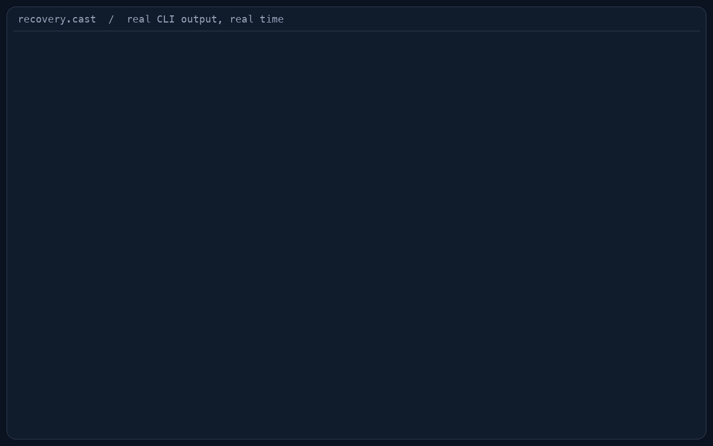
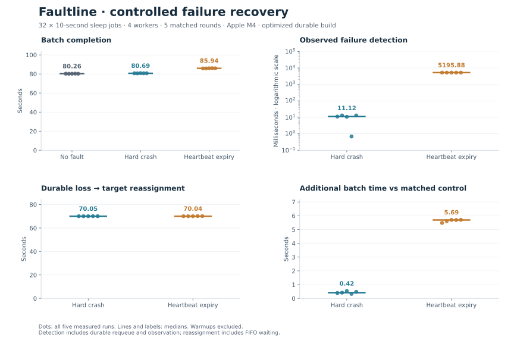

# Faultline

**An open-source, fault-tolerant job execution engine, built in C11.**

[](https://github.com/farukumarx64/faultline-c/actions/workflows/linux-ci.yml)

Submit a job, let a worker execute it, and inspect the result. Faultline schedules
independent jobs across worker processes, retries interrupted work, and restores
coordinator state from a write-ahead log after a restart.

Built to make distributed-systems behavior visible: explicit TCP framing, FIFO
scheduling, heartbeat-based failure detection, bounded retries, and durable state.
The current MVP runs as multiple processes **on one machine**, with the coordinator
listening on IPv4 loopback. It targets macOS and Linux.

[Quick start](#quick-start) · [Recovery demo](#recovery-demo) · [Commands](#commands) · [Benchmarks](#benchmarks) ·
[Guarantees](#guarantees) · [Limitations](#limitations) · [Documentation](#documentation)

[v0.1.0 release notes](docs/releases/v0.1.0.md)

## How it works

[](docs/diagrams/architecture.svg)

Each worker has its own TCP connection. The dashed path shows heartbeats on that
same connection; the WAL paths are local file I/O. The two-second heartbeat and
six-second timeout are configurable defaults.

- **Schedule:** the coordinator gives the oldest queued job to an alive, idle worker.
- **Execute:** workers run `sleep`, `prime_count`, `fibonacci`, or `hash` while sending heartbeats.
- **Recover:** a lost connection or expired heartbeat revokes the assignment; eligible work returns to the queue.
- **Persist:** the coordinator syncs state changes to the WAL before acknowledging submissions, dispatching work, or publishing results.
- **Inspect:** the CLI exposes job state, results, worker liveness, and statistics.

The normal job lifecycle is `QUEUED → ASSIGNED → RUNNING → DONE`. Failed or
interrupted attempts rejoin the FIFO tail while retries remain; otherwise the
job becomes `FAILED`. See the [architecture](docs/architecture.md#components-and-ownership)
for message flow and ownership, or the [editable diagram source](docs/diagrams/architecture.mmd).

## Quick start

You need **Make, a C11 compiler (Clang or GCC), and POSIX threads/sockets**.
There are no third-party C library dependencies. Tests and the recovery demo
also require Python 3.9 or newer.

### 1. Build

```sh
git clone https://github.com/farukumarx64/faultline-c.git
cd faultline-c
make
```

Run the following commands from the project root in three terminals.

### 2. Start the coordinator — terminal 1

Create a new WAL on the first launch:

```sh
./build/debug/faultline-coordinator --port 9000 --wal faultline.wal --init-wal
```

`--init-wal` refuses to overwrite an existing file. If you have already created
this log, use the [restart command](#stop-and-restart) below.

### 3. Start a worker — terminal 2

```sh
./build/debug/faultline-worker
```

The worker prints its assigned ID and stays connected. Open more terminals and
run the same command to add workers; each receives a distinct ID.

### 4. Submit and inspect — terminal 3

```sh
./build/debug/faultline ping
# PONG

./build/debug/faultline submit sleep --args 1000 --max-retries 1
# job_id=1  (on a fresh log)

./build/debug/faultline status 1
```

Use the ID printed by your submission. Submission confirms **durable acceptance**;
`status` reads one snapshot and does not wait for completion. Run it again if the
job is still queued or running. Once job 1 finishes on worker 1, expect:

```text
job_id=1
state=DONE
worker_id=1
attempt=1
retries=0/1
failure=NONE
result_bytes=13
result="slept_ms=1000"
```

### Stop and restart

Stop workers and the coordinator with **Ctrl+C**. Keep the WAL. To restore the
same coordinator state, omit `--init-wal`:

```sh
./build/debug/faultline-coordinator --port 9000 --wal faultline.wal
```

Start workers again in their terminals. Old connections cannot be restored, and
workers do not automatically reconnect. Saved terminal results remain queryable;
interrupted assignments follow the [retry policy](#guarantees).

## Recovery demo

One job, two workers, one hard crash. The busy worker is killed with `SIGKILL`;
the already-connected survivor completes **the same job ID on attempt 2**.



Reproduce it with the real executables:

```sh
make demo-recovery
```

The command uses a fresh WAL and an available port, verifies the result, and
cleans up its processes. The GIF replays actual CLI output at its recorded pace.
[Run, record, and verify the demo →](docs/recovery-demo.md)

## Commands

All three programs default to `127.0.0.1:9000`. These examples use the debug build;
`make sanitize` creates equivalent executables under `build/sanitize/`.

| Command | What it shows or does |
| --- | --- |
| `./build/debug/faultline ping` | Check coordinator connectivity; expect `PONG` |
| `./build/debug/faultline submit TASK --args TEXT --max-retries N` | Submit work and print its job ID |
| `./build/debug/faultline status ID` | State, worker, attempt, retries, result, or failure for one job |
| `./build/debug/faultline jobs` | All retained jobs, including `DONE` and `FAILED` |
| `./build/debug/faultline workers` | Registered worker liveness, heartbeat age, and active assignments |
| `./build/debug/faultline stats` | Retained job totals, current worker gauges, and session activity |

`status` exits **0 for a known job, including a failed one**, **2 for an unknown
ID**, and **1 for an error**. Scripts must inspect the reported state to determine
job success. Job totals survive restart; worker gauges and session measurements
start afresh. See [status](docs/status.md), [listings](docs/listings.md), and
[counter definitions](docs/stats.md).

### Built-in tasks

```sh
./build/debug/faultline submit sleep --args 1000 --max-retries 1
./build/debug/faultline submit prime_count --args 100
./build/debug/faultline submit fibonacci --args 10
./build/debug/faultline submit hash --args hello
```

| Task | Input | Result for the example above |
| --- | --- | --- |
| `sleep` | Duration in milliseconds, 0–86,400,000 | `slept_ms=1000` |
| `prime_count` | Inclusive upper bound, 0–100,000,000 | `25` |
| `fibonacci` | Sequence index, 0–93 | `55` |
| `hash` | Up to 1,024 bytes; FNV-1a 64-bit, non-cryptographic | `a430d84680aabd0b` |

Numeric inputs are decimal integers. Use `--args-hex HEX` instead of `--args TEXT`
for binary input. The retry allowance defaults to **zero**; `--max-retries 2`
permits at most three attempts. [Task details →](docs/tasks.md)

<details>
<summary><strong>Change the port or heartbeat timings</strong></summary>

Stop the existing processes first. These commands reuse the WAL created above:

```sh
# Coordinator: listen on port 9100; expire after six seconds of silence.
./build/debug/faultline-coordinator --port 9100 --wal faultline.wal --heartbeat-timeout-ms 6000

# Worker, in another terminal: send a heartbeat every two seconds.
./build/debug/faultline-worker --coordinator 127.0.0.1:9100 --heartbeat-interval-ms 2000

# CLI, in a third terminal: select the same endpoint for any command.
./build/debug/faultline ping --coordinator 127.0.0.1:9100
```

Two-second heartbeats and a six-second timeout are the defaults. Keep the timeout
comfortably above the worker interval; the processes do not negotiate these
settings. Endpoints accept numeric IPv4 addresses. The coordinator currently
binds only to `127.0.0.1`. [Worker configuration →](docs/workers.md)

</details>

## Benchmarks

Measured on **Apple M4 · 10 cores (4 Performance + 6 Efficiency) · 16 GiB RAM**,
with an internal APFS SSD, macOS 27.0.1, and Apple Clang 21. Builds used
`-O2 -g -Werror`, sanitizers off, and normal logging and WAL synchronization.
AC power and low-power mode off were checked before and after every sample.

Each configuration has **five measured repetitions**, with warmups excluded.
These are single-machine results for the specified workloads, not multi-host
performance claims. Full reports retain individual samples, ranges, source
revisions, machine observations, and evidence hashes.

### Worker scaling · October 1, 2026

64 CPU-bound `prime_count(10000000)` jobs per run, each verified to return `664579`.
All **1,536 jobs** across warmups and measured runs completed correctly, with no
retries or terminal failures.

| Workers | Median batch time | Median jobs/s | Mean job latency¹ | Speedup |
| ---: | ---: | ---: | ---: | ---: |
| 1 | 59.008 s | 1.085 | 29.076 s | 1.000× |
| 2 | 29.856 s | 2.144 | 14.457 s | 1.976× |
| 4 | 16.924 s | 3.782 | 7.894 s | 3.487× |
| 8 | 13.942 s | 4.590 | 6.717 s | **4.232×** |

¹ Median of each run's mean acceptance-to-completion latency, including queue
waiting. Batch time includes submission, execution, persistence, and completion
observation; it excludes startup and final verification/cleanup.

Eight workers finished the batch **4.232× faster** than the same campaign's
one-worker median. Going from four to eight workers improved throughput by about
**21.4%**. The experiment shows diminishing gains but does not isolate a bottleneck.

[Full scaling report](docs/benchmark-scaling.md) ·
[JSON](benchmarks/results/scaling-20261001.json) ·
[CSV](benchmarks/results/scaling-20261001.csv)

### Controlled recovery · October 2, 2026

32 ten-second `sleep` jobs per run, four workers, and one allowed retry per job.
Hard crashes (`SIGKILL`) and heartbeat expiry (a ten-second `SIGSTOP` pause) were
measured separately against matching no-fault runs.

| Scenario | Median batch time | Observed detection² | Paired extra time³ |
| --- | ---: | ---: | ---: |
| No fault | 80.264 s | — | — |
| Hard crash | 80.689 s | 11.119 ms | +0.418 s |
| Heartbeat expiry | 85.939 s | 5,195.880 ms | +5.691 s |

² Median signal-to-observed durable worker-loss event; includes storage, logging,
and observation delay. Heartbeat expiry uses time since the last heartbeat, so
six seconds of silence need not mean six seconds after the pause signal.

³ Median of same-round fault-minus-control differences, not the difference of
the table's batch medians.



All **576 jobs** across 18 runs completed correctly. Each of the 12 fault runs
used exactly one retry; there were **zero terminal failures**. The interrupted
job waited roughly 70 seconds for reassignment because it rejoined the FIFO tail
behind queued work. That delay is distinct from detecting the worker's loss.

[Full recovery report and limits](docs/benchmark-recovery.md) ·
[JSON](benchmarks/results/recovery-20261002.json) ·
[CSV](benchmarks/results/recovery-20261002.csv)

<details>
<summary><strong>Reproduce the measurements</strong></summary>

Use a clean, committed checkout on macOS, with stable AC power and low-power mode
off. Automatic machine/power validation currently supports macOS. The runners
build optimized binaries, check correctness, then time the fixed profiles:

```sh
make benchmark-baseline   # One worker: warmup + five measured runs.
make benchmark-scaling    # 1, 2, 4, 8 workers; about 29 minutes on this M4.
make benchmark-recovery   # Matched controls and faults; about 35–40 minutes.
```

Campaigns enforce deadlines, verify every job and result, and clean up their
processes. Each run preserves logs, summaries, traces, and WALs under a unique
ignored `build/benchmarks/` directory. **Archive evidence before `make clean`,
which removes `build/`.** Failed campaigns remain evidence but are excluded from
published performance aggregates.

AC power is a measurement condition, not a requirement for running Faultline or
its ordinary tests. Boundary checks do not establish continuous power stability;
thermal telemetry was unavailable. See the [benchmark contract](docs/benchmarks.md)
for timing definitions, machine requirements, and interpretation limits.

</details>

## Guarantees

| Boundary | What Faultline guarantees |
| --- | --- |
| Submission acknowledgment | A complete creation record is synced to the WAL before the coordinator sends an ACK. An acknowledged job is recoverable after a coordinator process crash with the same retained log and working storage. |
| Assignment and completion | Assignments are durable before dispatch. Accepted results are durable before publication. Reports must match the job, worker, and attempt; stale reports cannot overwrite authoritative state. |
| Worker loss | Disconnect or heartbeat expiry revokes the assignment. Eligible work retries from the beginning at the FIFO tail; exhausted jobs become terminally `FAILED`. |
| Coordinator restart | Job IDs, inputs, results, retry accounting, identity counters, and queue order recover from the WAL. `DONE` and `FAILED` jobs stay terminal. Queued jobs do not spend a retry simply because the coordinator restarts. |
| Interrupted attempts | Recovered `ASSIGNED` or `RUNNING` jobs follow the worker-loss retry policy, including after an orderly shutdown. Workers establish fresh connections and registrations. |

**Execution uses bounded at-least-once retries.** An expired worker may still be
computing while a new attempt runs. Attempt checks protect coordinator state;
they do not make external effects happen exactly once. Tasks must be safe to
repeat, and a finite retry budget does not promise eventual success.

**A missing ACK leaves submission uncertain.** The job may already be durable.
Submitting it again can create a second job; request deduplication is deferred.

Read the [recovery guarantees](docs/recovery.md) and
[persistence review](docs/persistence-review.md) for crash boundaries and evidence.

## Limitations

- **Local deployment:** IPv4 loopback only; no coordinator bind-address option,
  hostname resolution, IPv6, authentication, or TLS.
- **Bounded storage:** 256 retained jobs, including terminal jobs; 1,024-byte
  arguments and results; 64 simultaneous client connections shared by workers
  and CLI requests. Restarting does not free retained job slots.
- **Append-only persistence:** no WAL compaction or job eviction. The durability
  contract covers process crashes with working storage, not disk loss or
  universal power-loss survival.
- **One coordinator:** no replication, consensus, automatic failover, or worker
  reconnection. Scheduling pauses while the coordinator is down.
- **Liveness, not progress:** heartbeats do not prove a task is advancing. There
  is no independent job execution deadline or checkpoint/resume support.
- **Four built-in tasks:** no arbitrary shell execution, task plugins, or web dashboard.

[Optional post-MVP work](docs/post-mvp.md) records request deduplication and
potential battery-only / Low Power Mode benchmark profiles. These remain proposals.

## Testing

```sh
make test             # C unit/storage/socket tests + real-process integration tests.
make test-sanitize    # The same suites with AddressSanitizer and UBSan.
make test-batch       # Separate no-fault workload with per-job result verification.
make test-chaos       # Separate seeded worker crashes and replacement experiment.
```

The [Linux CI workflow](.github/workflows/linux-ci.yml) runs on pushes and pull
requests using Ubuntu 24.04: GCC 13 for normal builds and Clang 18 for ASan/UBSan.
It treats warnings as errors, runs harness regressions and a fixed-seed chaos
experiment, enforces deadlines and cleanup, and uploads available evidence after
success or failure. Checks reject missing IDs, wrong results, invalid retries,
and insufficient recovery coverage; matching totals alone cannot pass.

See the [test guide](tests/README.md) for focused targets and diagnostics, the
[chaos review](docs/chaos-review.md) for multi-seed evidence, and the
[CI guide](docs/ci.md) for Linux reproduction and hosted validation records.
The [release checklist](docs/release-checklist.md) records fresh-clone checks,
the tested revision, and the scope of the latest release review.

## Documentation

| Start here for… | Guides |
| --- | --- |
| System design | [Architecture](docs/architecture.md) · [Job model](docs/jobs.md) · [Scheduling](docs/scheduling.md) |
| Wire format and connections | [Protocol](docs/protocol.md) · [Networking](docs/networking.md) · [Workers](docs/workers.md) |
| Using and observing jobs | [Tasks](docs/tasks.md) · [CLI status](docs/status.md) · [Logs](docs/logging.md) |
| Failure and restart behavior | [Recovery](docs/recovery.md) · [Durability contract](docs/durability.md) · [Persistence](docs/persistence.md) |
| WAL implementation | [Record format](docs/wal-format.md) · [Writer](docs/wal-writer.md) · [Replay](docs/wal-replay.md) |
| Experiments and measurements | [Chaos harness](docs/chaos-testing.md) · [Benchmark contract](docs/benchmarks.md) · [Results](benchmarks/results/) |
| Release verification | [Release checklist](docs/release-checklist.md) · [Linux CI](docs/ci.md) |
| Possible extensions | [Post-MVP notes](docs/post-mvp.md) · [Request deduplication](docs/request-deduplication.md) |

### Source layout

```text
src/coordinator/   Event loop, registry, scheduler, job store, and persistence
src/worker/        Registration, heartbeats, and task execution
src/cli/           Submission and inspection commands
src/common/        Shared protocol, networking, and logging code
include/           Shared C headers
tests/             Unit tests, process tests, and workload/chaos harnesses
benchmarks/        Campaign runners, fixed profiles, and reviewed reports
docs/              Design notes, contracts, and verification evidence
```

## License

Faultline is open source under the [MIT License](LICENSE).
Copyright (c) 2026 Faruk Umar.
